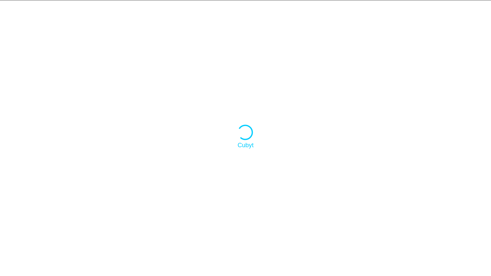
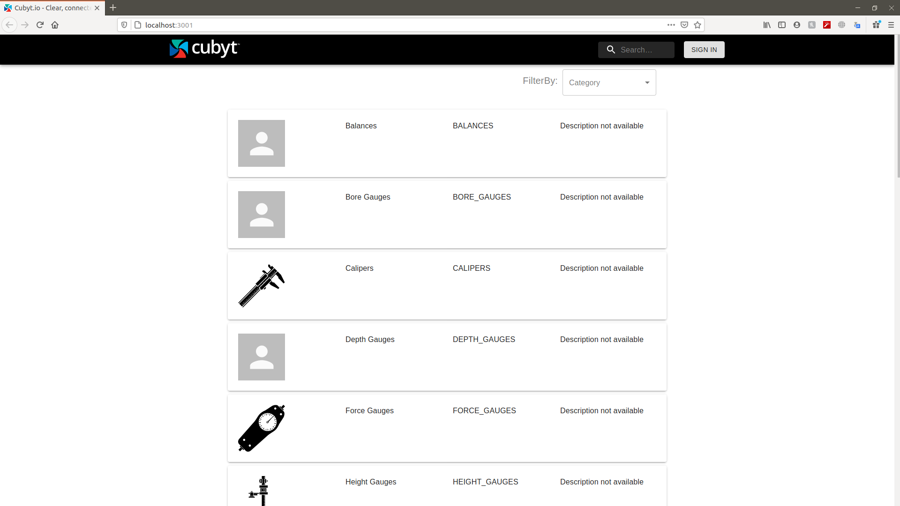
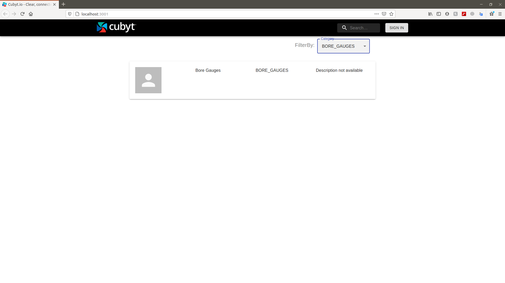
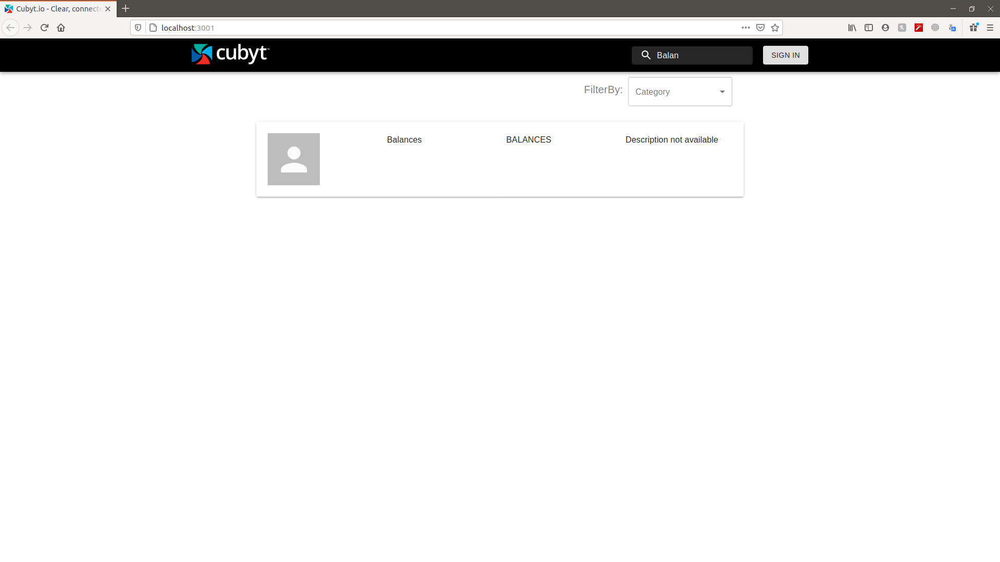

## Steps to follow

- Server

  1. Open terminal and type the following command to install the node_modules

     ```
     cd backend

     yarn

     or

     npm install
     ```

  1. Add the .env file inside backend folder with the following parameters:

     ```
     DATA_URL=https://www.cubyt.io/data/categories
     ```

  1. To run it locally type the following command in terminal inside server folder

     ```
     sam local start-api
     ```

  1. To deploy the backend on aws type the following command in terminal and fill the details asked in terminal

     ```
      sam build
      sam deploy --guided
     ```

  1. Copy down the url got after running application locally. It will be used in client side.

* Client

  1. open terminal and type the following command to install the node_modules

     ```
     yarn

     or

     npm install
     ```

  1. Add .env file in client folder with your api gateway url (got from backend deployment) .
     Example:

     ```
     REACT_APP_SERVER_URL=http://127.0.0.1:3000
     ```

  1. Type the following command to run the client:

     ```
     npm run start

     or

     yarn start
     ```

# Screenshorts

### Loading Screen



### Dashboard



### Category Filtered Dashboard



### Search


